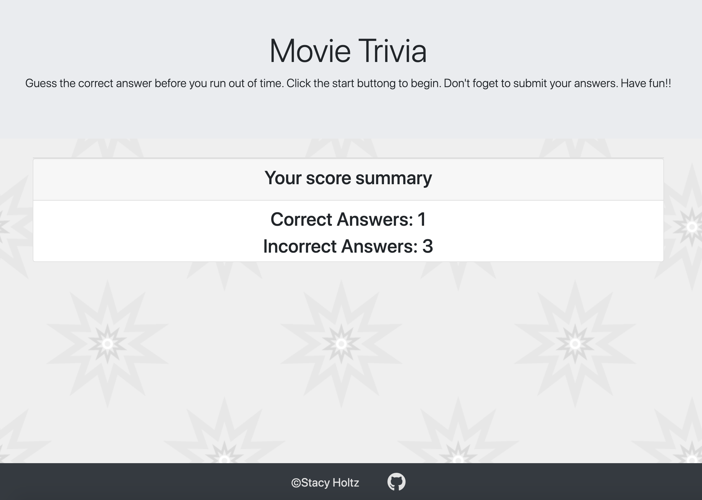

# TriviaGame

### Link to Live Game:
[Trivia Game](https://stacyholtz6.github.io/TriviaGame/)

## Game Objective:
```
--- Guess the correct answers before time runs out. 
```
##### Game Instructions:
```
1. Select the correct answers for each of the trivia questions.
2. Submit your answers to get your score before you run out of time.

```
## Tools/Languages Used:
```
--- Javascript
--- JQuery
--- Bootstrap
--- HTML/CSS
```
## Game Features:

##### Start Screen:
```
FUNCTIONALITY:
- Game instructions are shown.
- User clicks start button to begin game.
```
#### Game Play Examples:

```
- Click start to begin
```


###### Triva Area/Timer
```
- Once the start button is clicked the trivia questions, answer choices, timer and submit button are shown. The start button is hidden.
```


###### Submit
```
- Click the submit button to get your score.

```

###### Game over 
```
- If you run out of time before you submit your answers the score summary is shown.
```


###### Correct/incorrect tracking
```
- Your final score is shown after the submit button is clicked.  
```
